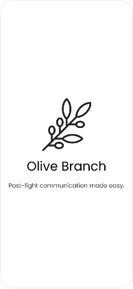
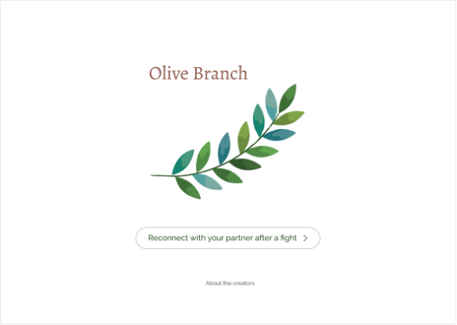

# Olive Branch
[](https://app.netlify.com/sites/olivebranch/deploys)


## Table of Contents
  * [Problem Background](#Problembackground)
  * [Visuals](#Visuals)
  * [Lofi & Hifi Mockups](#Lofi&HifiMockups)
  * [Installation](#Installation)
  * [Technologies](#Technologies)
  * [Deployed Site](#Deployed-Link)
  * [Contributors](#Contributors)
<p>&nbsp</p>  

---
<p>&nbsp</p>  

## Problem Background
The desire for human connection is a core human need.  However, when couples fight, that empathic connection to each other is temporarily lost which can lead to a further breakdown in communication. While most market offerings attempt to directly resolve the conflict, our team was curious about how effective communication techniques can help couples stay in connection with one another in these moments of disconnection. Our hypothesis, inspired by Marshall Rosenberg’s Nonviolent Communication, is that helping couples re-establish an empathic connection to one another first would help them reconcile more effectively. 

<p>&nbsp</p>  

## Visuals


<p>&nbsp</p> 

## Lofi & Hifi Mockups




<p>&nbsp</p> 

## Installation
To install a project, run:
```bash
npx create-next-app@latest
# or
yarn create next-app
```

After the installation is complete, run the development server:
```bash
npm run dev
# or
yarn dev
```
Visit http://localhost:3000 to view your application.

For more information on how to use create-next-app, you can review the [create-next-app](https://nextjs.org/docs/api-reference/create-next-app) documentation.
<p>&nbsp</p> 

## Technologies
* Next.js 
* React.js
* Sass
* JavaScript
* Uppy.io
* Twilio
* Figma
* Zeplin
* Miro

<p>&nbsp</p> 

## Deployed Site
[Live Site](https://olivebranch.netlify.app/)

[Demo Video](https://www.joincolab.io/projects/olive-branch)
<p>&nbsp</p> 

## Contributors
* Marissa [LinkedIn](https://www.linkedin.com/in/marissa-o/) [Github](https://github.com/marissao)
* Alex [LinkedIn](https://www.linkedin.com/in/itsalexlee/) [Portfolio](https://itsalexlee.com/product)
* Cheng [LinkedIn](https://www.linkedin.com/in/chengux/) [Portfolio](https://www.chengg.design/)
* Ken [LinkedIn](https://www.linkedin.com/in/kent28808/) [Github](https://github.com/kent28808)


